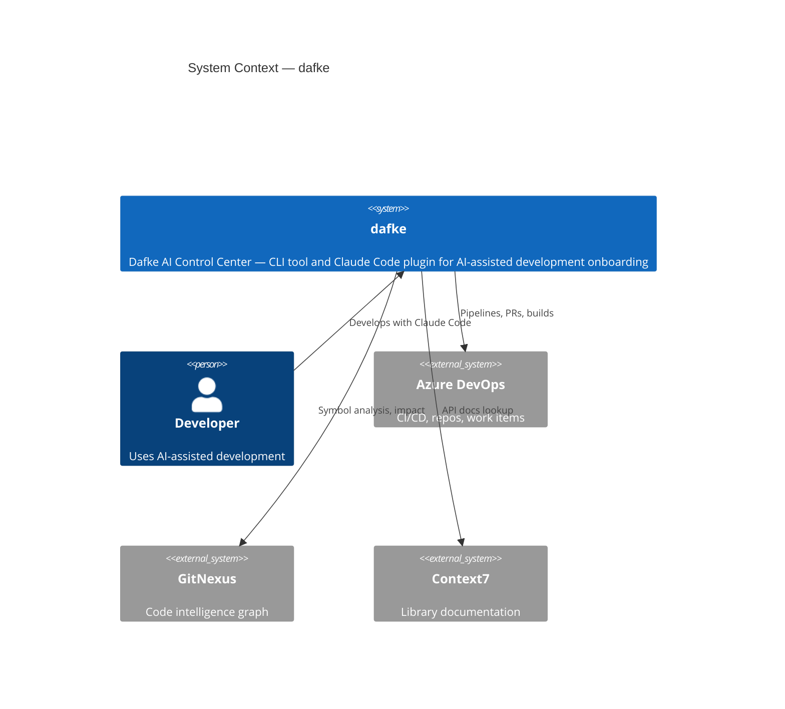

# dafke — Architecture Documentation

> Generated by `dafke docs` on 2026-04-28.
> Regenerate with: `dafke docs` or `/dafke-arch` in Claude Code.

**Tech Stack:** TypeScript

---

## Table of Contents

- [System Context (C4)](#system-context-c4)

- [Module Documentation](#module-documentation)

- [Risk Assessment](#risk-assessment)

---

## System Context (C4)

## Module Documentation

5 module(s) documented:

- [adapters](modules/adapters.md)
- [cli](modules/cli.md)
- [core](modules/core.md)
- [integrations](modules/integrations.md)
- [utils](modules/utils.md)

## Risk Assessment

- **Circular dependencies**: None detected

---

_Generated by dafke docs on 2026-04-28. Regenerate with `dafke docs` or `/dafke-arch`._
