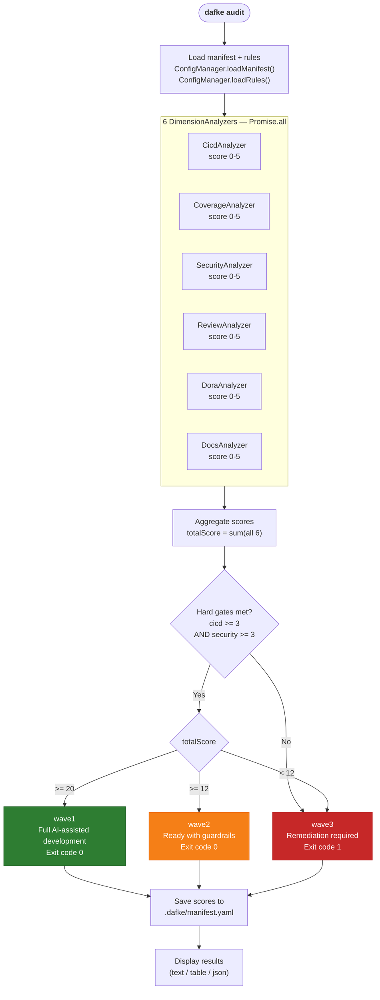
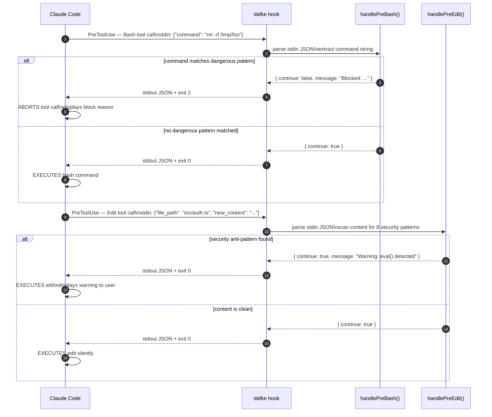
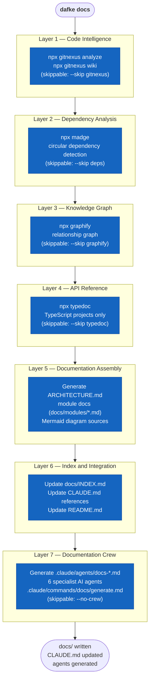

# CLI Commands Reference — dafke

> Version 0.4.1. All details derived from `src/cli/commands/`.

---

## Global Options

| Flag | Type | Default | Description |
|------|------|---------|-------------|
| `--config`, `-c` | `string` | `~/.dafke/config.yaml` | Path to global config file |

---

## Command Index

| Command | Purpose | Interactive | Exit Code on Failure |
|---------|---------|-------------|----------------------|
| [`init`](#init) | 13-step onboarding wizard | Yes | 1 |
| [`audit`](#audit) | 6-dimension readiness assessment | No | 1 (hard gates failed) |
| [`resolve`](#resolve) | Auto-generate config files to close readiness gaps | No | 0 |
| [`update`](#update) | Detect config drift and apply corrections | Yes (confirm prompt) | 0 |
| [`status`](#status) | Dashboard of repo readiness scores | No | 0 |
| [`doctor`](#doctor) | Self-heal broken configs | No | 0 |
| [`connect`](#connect) | Set up external service credentials | Yes | 0 |
| [`repos`](#repos) | List repositories from Azure DevOps or GitHub | No | 0 |
| [`hook`](#hook) | Claude Code hook event handler | No (stdin/stdout) | 2 (block) |
| [`plugin`](#plugin) | Manage Dafke Claude Code plugins | No | 0 |
| [`skills`](#skills-deprecated) | DEPRECATED — redirects to `plugin` | No | 0 |
| [`docs`](#docs) | Scaffold architecture documentation | No | 0 |

---

## init

**Synopsis**: `dafke init [options]`

Initialize AI-assisted development for a repository. Runs a 13-step wizard covering authentication, tech-stack detection, readiness assessment, CLAUDE.md generation, hooks, plugins, CI hardening, coverage analysis, architecture docs, project board connection, and final verification. Wizard state is checkpoint-resumable via `--resume`.

**Requires**: Claude Code CLI (`claude` binary on PATH).

### Options

| Flag | Type | Default | Description |
|------|------|---------|-------------|
| `--resume` | `boolean` | `false` | Resume from last checkpoint (reads `.dafke/state.json`) |
| `--skip` | `string` | — | Comma-separated step IDs to skip |
| `--tech-stack` | `string` | — | Override auto-detection of tech stack |
| `--non-interactive` | `boolean` | `false` | Use defaults; suppress all interactive prompts |
| `--verbose` | `boolean` | `false` | Show detailed step output |

**`--skip` valid values**: `auth`, `detect`, `assess`, `external_tools`, `claude_md`, `rules`, `hooks`, `plugins`, `ci`, `coverage`, `arch`, `connect`, `verify`

**`--tech-stack` valid values**: `typescript`, `java`, `dotnet`, `python`, `delphi`, `foxpro`

### Wizard Steps

| Step ID | Label |
|---------|-------|
| `auth` | Authentication & Providers |
| `detect` | Repository Detection |
| `assess` | Readiness Assessment |
| `external_tools` | External Tools |
| `claude_md` | CLAUDE.md Generation |
| `rules` | Instruction Rules |
| `hooks` | Hooks & Settings |
| `plugins` | Plugin Installation |
| `ci` | CI/CD Hardening |
| `coverage` | Test Coverage Analysis |
| `arch` | Architecture Documentation |
| `connect` | Project Board Connection |
| `verify` | Verification & Summary |

### Files Written

| File | Purpose |
|------|---------|
| `.dafke/manifest.yaml` | Repo manifest (tech stack, CI platform, scores) |
| `.dafke/state.json` | Checkpoint state (used by `--resume`) |
| `.claude/settings.json` | Claude Code hook registrations |
| `CLAUDE.md` | AI development guidelines for the repo |
| `.claude/rules/*.md` | Tech-specific instruction rule files |

### Exit Codes

| Code | Meaning |
|------|---------|
| 0 | Wizard completed successfully |
| 1 | Claude Code CLI not found; invalid `--skip` or `--tech-stack` argument |

### Examples

```sh
# Full interactive init
dafke init

# Resume after an interrupted run
dafke init --resume

# Skip authentication and assessment (for pre-configured repos)
dafke init --skip auth,assess

# Non-interactive with TypeScript forced
dafke init --non-interactive --tech-stack typescript

# Verbose output for debugging wizard steps
dafke init --verbose
```

---

## audit

**Synopsis**: `dafke audit [options]`

Run a readiness assessment across 6 dimensions. Each dimension is scored 0–5 by a dedicated analyzer. The `cicd` and `security` dimensions are hard gates: both must score >= 3 for wave1/wave2 eligibility. Results are persisted to `.dafke/manifest.yaml` if a manifest exists. Exits with code 1 if any hard gate fails.



### Options

| Flag | Type | Default | Description |
|------|------|---------|-------------|
| `--format` | `string` | `text` | Output format: `text`, `table`, or `json` |
| `--dimension` | `string` | — | Drill into a single dimension by name |
| `--override` | `string` | — | Manually override dimension scores, e.g. `cicd=5,security=4` |
| `--explain` | `boolean` | `false` | Append scoring rationale for all dimensions |
| `--deep` | `boolean` | `false` | Run AI-powered deep analysis (requires Claude Code CLI) |

**`--dimension` valid values**: `cicd`, `coverage`, `security`, `review`, `dora`, `docs`

### Dimensions

| Dimension | Label | Hard Gate | Minimum for Wave1/2 |
|-----------|-------|-----------|---------------------|
| `cicd` | CI/CD Maturity | Yes | >= 3 |
| `coverage` | Test Coverage | No | — |
| `security` | Security Pipeline | Yes | >= 3 |
| `review` | Code Review Culture | No | — |
| `dora` | DORA Metrics | No | — |
| `docs` | Documentation | No | — |

### Score Display Thresholds

| Score | Display Color |
|-------|---------------|
| >= 4 | Green |
| >= 3 | Yellow |
| < 3 | Red |

### Wave Assignment

| Wave | Condition |
|------|-----------|
| `wave1` | Hard gates met AND total score >= 20 |
| `wave2` | Hard gates met AND total score >= 12 |
| `wave3` | Any hard gate below 3 OR total score < 12 |

### JSON Output Schema (`--format json`)

```json
{
  "scores": {
    "cicd": 3, "coverage": 4, "security": 3,
    "review": 2, "dora": 1, "docs": 2
  },
  "totalScore": 15,
  "wave": "wave2",
  "improvementPlan": [
    {
      "dimension": "review",
      "priority": "high",
      "action": "...",
      "currentScore": 2,
      "targetScore": 3,
      "estimatedTime": "..."
    }
  ],
  "dimensionResults": [
    {
      "dimension": "cicd",
      "details": "...",
      "evidence": ["..."],
      "suggestions": ["..."],
      "scoringRationale": "..."
    }
  ]
}
```

### Exit Codes

| Code | Meaning |
|------|---------|
| 0 | Assessment complete, hard gates passed |
| 1 | One or more hard gates failed (cicd or security < 3) |

### Examples

```sh
# Standard text assessment
dafke audit

# Machine-readable output for CI integration
dafke audit --format json

# Table view across all dimensions
dafke audit --format table

# Deep-dive into the security dimension
dafke audit --dimension security

# Override a score that cannot be auto-detected
dafke audit --override dora=3

# Show rationale for every score
dafke audit --explain

# Full AI-powered analysis
dafke audit --deep
```

---

## resolve

**Synopsis**: `dafke resolve [options]`

Auto-generate configuration files to close readiness gaps in the CI/CD, security, coverage, and review dimensions. Runs four resolvers in order: `CicdResolver`, `SecurityResolver`, `CoverageResolver`, `ReviewResolver`. Does not overwrite existing files unless `--force` is set.

### Options

| Flag | Type | Default | Description |
|------|------|---------|-------------|
| `--dimension` | `string` | — | Limit to specific dimension(s), comma-separated |
| `--dry-run` | `boolean` | `false` | Preview what would be generated without writing any files |
| `--force` | `boolean` | `false` | Overwrite existing files |
| `--format` | `string` | `text` | Output format: `text` or `json` |

**`--dimension` valid values**: `cicd`, `security`, `coverage`, `review`

### JSON Output Schema (`--format json`)

```json
{
  "results": [
    {
      "dimension": "cicd",
      "previousScore": 1,
      "expectedScore": 3,
      "summary": "...",
      "generatedFiles": [
        {
          "relativePath": "azure-pipelines.yml",
          "content": "...",
          "written": true,
          "existedBefore": false,
          "skipReason": null
        }
      ]
    }
  ],
  "previousTotalScore": 10,
  "expectedTotalScore": 16,
  "totalFilesGenerated": 3,
  "totalFilesSkipped": 1,
  "warnings": []
}
```

### Exit Codes

| Code | Meaning |
|------|---------|
| 0 | Resolution complete (including partial — skipped files are not errors) |

### Examples

```sh
# Resolve all fixable gaps
dafke resolve

# Preview only — no files written
dafke resolve --dry-run

# Fix only CI/CD gaps and overwrite existing files
dafke resolve --dimension cicd --force

# Fix multiple specific dimensions
dafke resolve --dimension cicd,security

# JSON output for automation
dafke resolve --format json
```

---

## update

**Synopsis**: `dafke update [options]`

Detect config drift between generated files and current templates. Displays a diff for each drifted file, then optionally applies corrections. Also detects legacy `.claude/skills/dafke-*` and `.claude/agents/dafke-*` directories. With `--plugins`, updates installed Dafke plugins and migrates legacy files.

### Options

| Flag | Type | Default | Description |
|------|------|---------|-------------|
| `--check` | `boolean` | `false` | Report drift without applying changes |
| `--force` | `boolean` | `false` | Apply all corrections without showing a confirmation prompt |
| `--plugins` | `boolean` | `false` | Also update Dafke plugins and migrate legacy skill/agent files |

### Behavior

1. Checks for a newer `dafke` version on the npm registry.
2. Loads `.dafke/manifest.yaml`; exits early if none found (instructs user to run `init`).
3. Runs drift detection against all template-generated files.
4. Reports legacy skill/agent directories.
5. Without `--check`: prompts for confirmation (skipped with `--force`), applies updates, bumps `manifest.corulusCcVersion`.
6. With `--plugins`: calls `claude plugin update` for each Dafke plugin, removes legacy files identical to plugin templates, warns about modified legacy files.

### Exit Codes

| Code | Meaning |
|------|---------|
| 0 | Check complete or corrections applied |

### Examples

```sh
# Check drift without touching anything (CI-safe)
dafke update --check

# Apply drift corrections interactively
dafke update

# Apply corrections silently
dafke update --force

# Update plugins and migrate legacy skill files
dafke update --plugins

# Full check including plugin state
dafke update --check --plugins
```

---

## status

**Synopsis**: `dafke status [options]`

Read-only dashboard showing the current repo's readiness scorecard from `.dafke/manifest.yaml`. Displays scores, wave assignment, drift status, and three success-criteria groups (Adoption, Quality, Experience). Does not run any analyzers; data reflects the last `dafke audit` run.

### Options

| Flag | Type | Default | Description |
|------|------|---------|-------------|
| `--format` | `string` | `text` | Output format: `text` or `json` |
| `--explain` | `boolean` | `false` | Show dimension definitions and full scoring rubrics |

### JSON Output Schema (`--format json`)

```json
{
  "version": "0.4.1",
  "configSchemaVersion": 1,
  "techStack": "typescript",
  "wave": "wave2",
  "lastAudit": "2026-04-28T10:00:00.000Z",
  "scores": {
    "cicd": 3, "coverage": 4, "security": 3,
    "review": 2, "dora": 1, "docs": 2
  }
}
```

When `--explain` is passed, the response includes an `"explanations"` field with dimension rubrics and success-criteria thresholds.

### Success Criteria Groups

| Group | Metrics |
|-------|---------|
| Adoption | Activation Rate, Daily Usage, AI Share Tier |
| Quality | CFR Trend, Coverage %, PR Cycle Time |
| Experience | NPS, Training Satisfaction |

Each metric is shown as a traffic-light indicator (green / yellow / red) derived from dimension scores.

### Exit Codes

| Code | Meaning |
|------|---------|
| 0 | Scorecard displayed (or manifest not found — soft error, informs user) |

### Examples

```sh
# Interactive dashboard
dafke status

# Machine-readable output
dafke status --format json

# Full scoring guide including rubrics
dafke status --explain

# JSON + rubrics combined
dafke status --format json --explain
```

---

## doctor

**Synopsis**: `dafke doctor [--fix]`

Runs 10 health checks sequentially (via Listr2) and reports pass/fail. Fixable checks are repaired in-place when `--fix` is set. After checks, displays availability of Claude-CLI-dependent smart features.

### Options

| Flag | Type | Default | Description |
|------|------|---------|-------------|
| `--fix` | `boolean` | `false` | Attempt to auto-repair all fixable issues |

### Checks Performed

| Check | Fixable | Auto-fix Action |
|-------|---------|-----------------|
| System dependencies (git, node, claude, gitleaks, lefthook, az, gh) | No | — |
| `.dafke/` directory | Yes | Creates directory |
| `manifest.yaml` | Yes | Creates default manifest from wizard state |
| `.claude/settings.json` | Yes | Creates `{ "permissions": {} }` skeleton |
| `CLAUDE.md` | Yes | Creates placeholder file |
| Plugins (recommended set installed) | No | — |
| MCP servers (`.claude/mcp.json` or `.mcp.json`) | No | — |
| Git hooks (`lefthook.yml` or `lefthook.yaml`) | No | — |
| GitNexus index (`.gitnexus/` directory) | No | — |
| External tools (SonarQube auth, doc URL validity) | No | — |

### Smart Features Shown After Checks

- CLAUDE.md smart merge
- Plugin recommendations
- CI quality gate analysis
- Deep code audit
- AI conflict resolution

Of the five smart features, three depend on Claude CLI availability ("CLAUDE.md smart merge", "Deep code audit", "AI conflict resolution") and show green only when the Claude Code CLI is present. The remaining two ("Plugin recommendations" and "CI quality gate analysis") are always shown as available regardless of Claude CLI presence.

### Exit Codes

| Code | Meaning |
|------|---------|
| 0 | Check complete (issues reported as output, not exit codes) |

### Examples

```sh
# Report issues without changing anything
dafke doctor

# Attempt to auto-repair all fixable issues
dafke doctor --fix
```

---

## connect

**Synopsis**: `dafke connect [--service <name>]`

Interactive wizard to set up external service credentials. Credentials are saved to `~/.dafke/config.yaml` with file permissions `0o600`. Each flow tests the credentials against the remote service before saving; connection failures prevent storage of invalid credentials.

### Options

| Flag | Type | Default | Description |
|------|------|---------|-------------|
| `--service` | `string` | — | Service to connect directly (skips interactive selection) |

### Supported Services

| Value | Service | Required Fields |
|-------|---------|-----------------|
| `azure-devops` | Azure DevOps | Organization URL, Personal Access Token |
| `github` | GitHub | Personal Access Token |
| `jira` | Jira Cloud | Site URL, email, API token |
| `confluence` | Confluence Cloud | Site URL, email, API token |

### Credential Storage Schema

```yaml
# ~/.dafke/config.yaml (mode 0o600)
auth:
  azureDevOps:
    orgUrl: "https://dev.azure.com/dafkenv"
    pat: "<personal-access-token>"
  github:
    token: "<github-pat>"
  jira:
    siteUrl: "https://dafke.atlassian.net"
    email: "user@dafke.be"
    apiToken: "<api-token>"
  confluence:
    siteUrl: "https://dafke.atlassian.net"
    email: "user@dafke.be"
    apiToken: "<api-token>"
```

Credentials are stored as plaintext YAML protected by filesystem permissions only. There is no encryption at rest (see `docs/modules/security.md`, finding H-1).

### Exit Codes

| Code | Meaning |
|------|---------|
| 0 | Credentials saved (or service not reachable — soft error, does not save) |

### Examples

```sh
# Interactive service selection
dafke connect

# Direct to a specific service
dafke connect --service azure-devops
dafke connect --service github
dafke connect --service jira
dafke connect --service confluence
```

---

## repos

**Synopsis**: `dafke repos [options]`

List all accessible repositories from configured providers. Reads credentials from `~/.dafke/config.yaml`. Requires at least one provider to be connected via `dafke connect`.

### Options

| Flag | Type | Default | Description |
|------|------|---------|-------------|
| `--provider` | `string` | `all` | Provider: `azure-devops`, `github`, or `all` |
| `--format` | `string` | `text` | Output format: `text` or `json` |

### JSON Output Schema (`--format json`)

```json
[
  {
    "fullName": "dafkenv/my-repo",
    "provider": "azure-devops",
    "defaultBranch": "main",
    "cloneUrl": "https://dafkenv@dev.azure.com/dafkenv/my-project/_git/my-repo"
  },
  {
    "fullName": "dafke/other-repo",
    "provider": "github",
    "defaultBranch": "main",
    "cloneUrl": "https://github.com/dafke/other-repo.git"
  }
]
```

### Exit Codes

| Code | Meaning |
|------|---------|
| 0 | Repos listed (or provider not configured — soft error, prompts to run `connect`) |

### Examples

```sh
# List repos from all configured providers
dafke repos

# Azure DevOps only
dafke repos --provider azure-devops

# GitHub only, machine-readable
dafke repos --provider github --format json
```

---

## hook

**Synopsis**: `dafke hook [event]`

Claude Code hook event handler. Intended to be invoked by the Claude Code harness, not directly by developers (except via `hook list`). Reads a JSON payload from stdin and writes a JSON response to stdout. Exits with code 2 to block an action, 0 to allow.



### Positional Argument

| Argument | Required | Default | Description |
|----------|----------|---------|-------------|
| `event` | No | `list` | Hook event name, or `list` to show all configured hooks |

### Supported Events

| Event | Reads from stdin | Behavior |
|-------|-----------------|----------|
| `session-start` | No | Reads manifest; returns wave, drift status, handoff message |
| `pre-bash` | `command` or `input` | Blocks 14 dangerous shell patterns (exit 2 if blocked) |
| `pre-edit` | `file_path`, `content` or `new_content` | Scans for 8 security anti-patterns; skips test files; always `continue: true` |
| `post-bash` | `command` or `input` | Detects `git commit` and returns tracking metadata |
| `post-edit` | — | Returns `{ editCount: 1 }` |
| `stop` | — | Writes session handoff to `.claude/HANDOFF.md` (non-blocking) |
| `prompt-submit` | `prompt` or `input` | Extracts Jira, Azure DevOps, and GitHub ticket IDs |
| `skills-check` | — | Detects new skills available in package vs project |
| `doc-check` | — | Warns if `docs/ARCHITECTURE.md` is older than 7 days |
| `list` | — | Prints all configured Claude Code hooks and git hooks |

### Dangerous Patterns Blocked by `pre-bash`

| Pattern | Threat |
|---------|--------|
| `rm -rf /` | Filesystem destruction |
| `rm -rf *` | Wildcard deletion |
| `rm -rf ~` | Home directory destruction |
| `DROP TABLE` | Database table destruction |
| `DROP DATABASE` | Database destruction |
| `TRUNCATE TABLE` | Data truncation |
| `DELETE FROM ... ;` | Mass data deletion without WHERE |
| `mkfs.` | Disk format |
| `dd if=` | Raw disk write |
| Fork bomb (`:(){ :|:& };`) | Denial of service |
| `chmod -R 777 /` | Permission weakening |
| `git push --force origin main` | History destruction |
| `git push -f origin main` | History destruction |
| `git reset --hard HEAD~N` | Commit loss |

### Security Patterns Flagged by `pre-edit` (warn-only)

`eval(`, `innerHTML =`, `document.write(`, `child_process.exec(`, `Function(`, `dangerouslySetInnerHTML`, `child_process` (import), hardcoded credentials pattern (`password|secret|api_key|token = "..."`)

Test files (`.test.ts`, `.spec.ts`, `__tests__/`, `tests/`, `fixtures/`) are exempt from scanning.

### Ticket ID Patterns (prompt-submit)

| Format | Example | System |
|--------|---------|--------|
| `PROJ-123` | `BILLING-456` | Jira |
| `AB#123` | `AB#789` | Azure DevOps |
| `#123` | `#42` | GitHub |

### Response JSON Schema

```json
{
  "continue": true,
  "suppress": false,
  "message": "Optional message string",
  "data": {}
}
```

`continue: false` instructs Claude Code to block the action. `suppress: true` silences the blocking message in the UI.

### Stdin Size Limit

1 MB (1,048,576 bytes). Payloads larger than this are silently truncated. If stdin is a TTY, the payload defaults to `{}`.

### Exit Codes

| Code | Meaning |
|------|---------|
| 0 | Hook processed, action allowed |
| 2 | Hook blocked the action (`pre-bash` matched a dangerous pattern) |

### Examples

```sh
# List all configured hooks
dafke hook list
dafke hook

# Simulate pre-bash invocation
echo '{"command":"rm -rf /tmp"}' | dafke hook pre-bash

# Session start (no payload needed)
dafke hook session-start

# Ticket extraction test
echo '{"prompt":"Fix BILLING-123 and AB#456"}' | dafke hook prompt-submit
```

---

## plugin

**Synopsis**: `dafke plugin [action] [name]`

Manage Dafke Claude Code plugins through the Claude marketplace system. Requires Claude Code CLI. Validates plugin names against the canonical catalogue (`src/core/plugins/catalogue.ts`) before installation.

### Positional Arguments

| Argument | Required | Description |
|----------|----------|-------------|
| `action` | No | `list`, `install`, or `uninstall` (also accepts `remove`). Default: `list` |
| `name` | No | Plugin name (required for `install` and `uninstall`) |

### Available Plugins

| Plugin | Skills | Agents | Description |
|--------|--------|--------|-------------|
| `dafke-sdlc` | 9 | 5 | Story-to-PR development pipeline |
| `dafke-quality` | 6 | 5 | Code quality gates (lint, coverage, mutation, security, audit) |
| `dafke-observability` | 5 | — | CI/CD monitoring, DORA metrics, backlog |
| `dafke-docs` | 4 | 5 | Architecture docs, feature docs, onboarding |
| `dafke-config` | 4 | — | Init, doctor, update, discover |

### Behavior by Action

**`list`**: Calls `claude plugin list` and marks each Dafke plugin as installed / not installed.

**`install`**: Validates name against catalogue. Auto-registers the Dafke marketplace if not already present. Calls `claude plugin install <name>@dafke --scope project`.

**`uninstall` / `remove`**: Calls `claude plugin uninstall <name> --scope project`.

### Exit Codes

| Code | Meaning |
|------|---------|
| 0 | Action completed |

### Examples

```sh
# Show installation status of all Dafke plugins
dafke plugin list
dafke plugin

# Install a plugin
dafke plugin install dafke-sdlc
dafke plugin install dafke-quality

# Uninstall a plugin
dafke plugin uninstall dafke-sdlc
dafke plugin remove dafke-quality
```

---

## skills (DEPRECATED)

**Synopsis**: `dafke skills`

This command is deprecated. It prints a deprecation notice to stderr and exits with code 0. All functionality has moved to `dafke plugin`.

```
dafke skills is deprecated. Use `dafke plugin list` instead.
  Install plugins: `dafke plugin install <name>`
```

---

## docs

**Synopsis**: `dafke docs [options]`

Generate comprehensive architecture documentation through a 7-layer pipeline. Writes output to `docs/` (or the path specified by `--output`). Also updates `CLAUDE.md` and `README.md` with documentation references. Generates AI documentation crew agents in `.claude/agents/` by default.



### Options

| Flag | Type | Default | Description |
|------|------|---------|-------------|
| `--output` | `string` | `docs` | Output directory path |
| `--skip` | `string` | — | Comma-separated layers to skip: `gitnexus`, `graphify`, `typedoc`, `deps` |
| `--dry-run` | `boolean` | `false` | Preview what would be generated without writing any files |
| `--update` | `boolean` | `false` | Incremental — only regenerate docs for modules changed in the last 5 commits |
| `--crew` | `boolean` | `true` | Generate AI documentation crew agents (use `--no-crew` to skip) |
| `--format` | `string` | `markdown` | Output format for final summary: `markdown` or `json` |

### 7-Layer Pipeline

| Layer | Step | Tool | Skippable |
|-------|------|------|-----------|
| 1 | Code Intelligence | `npx gitnexus analyze` + `wiki` | `--skip gitnexus` |
| 2 | Dependency Analysis | `npx madge` | `--skip deps` |
| 3 | Knowledge Graph | `npx graphify` or `graphify` Python CLI | `--skip graphify` |
| 4 | API Reference | `npx typedoc` (TypeScript only) | `--skip typedoc` |
| 5 | Documentation Assembly | `ARCHITECTURE.md`, module docs, C4 diagram | Not skippable |
| 6 | Index & Integration | `INDEX.md`, `CLAUDE.md`, `README.md` updates | Not skippable |
| 7 | Documentation Crew | Agent files in `.claude/agents/`, workflow in `.claude/commands/docs/` | `--no-crew` |

### Output Files

| File | Description |
|------|-------------|
| `docs/ARCHITECTURE.md` | Main architecture document |
| `docs/INDEX.md` | Question-to-file routing table |
| `docs/modules/<name>.md` | Per-module documentation |
| `docs/diagrams/c4-context.mmd` | C4 context diagram (Mermaid source) |
| `docs/diagrams/dependencies.mmd` | Dependency graph (Mermaid source) |
| `docs/api/` | TypeDoc HTML output (TypeScript projects only) |
| `.claude/agents/docs-*.md` | AI crew agents (6 files) |
| `.claude/commands/docs/generate.md` | AI crew workflow (invocable as `/docs:generate`) |

### Crew Agents Generated

| Agent File | Role |
|------------|------|
| `docs-code-analyst.md` | Analyzes codebase structure and patterns |
| `docs-technical-writer.md` | Writes clear technical prose |
| `docs-critical-reader.md` | Reviews documentation for gaps |
| `docs-api-specialist.md` | Documents APIs and interfaces |
| `docs-security-reviewer.md` | Reviews documentation for security disclosures |
| `docs-doc-diagrammer.md` | Generates Mermaid diagrams |

### JSON Summary Schema (`--format json`)

```json
{
  "outputDir": "/path/to/docs",
  "techStack": "TypeScript",
  "stats": { "symbols": 2197, "edges": 4171, "clusters": 12, "flows": 177 },
  "wikiPages": 8,
  "moduleDocs": 5,
  "circularDeps": 0,
  "hasApi": true,
  "hasGraphify": false,
  "crew": { "agents": 6, "workflow": true },
  "archLines": 412
}
```

### Exit Codes

| Code | Meaning |
|------|---------|
| 0 | Documentation generated |

### Examples

```sh
# Full documentation generation
dafke docs

# Preview without writing files
dafke docs --dry-run

# Incremental update (only changed modules)
dafke docs --update

# Write to a custom directory
dafke docs --output .docs

# Skip slow layers for a quick refresh
dafke docs --skip gitnexus,graphify

# Generate without crew agent files
dafke docs --no-crew

# JSON summary output
dafke docs --format json
```

---

## Error Reference

### Validation Errors (exit code 1)

- `init --skip <invalid>` — prints valid step list, exits 1
- `init --tech-stack <invalid>` — prints valid stacks, exits 1
- `init` without Claude CLI — prints install URL, exits 1
- `audit` when hard gates fail — exits 1 after displaying results

### Soft Errors (logged, exit code 0)

- Missing manifest in `status`, `update`, `doctor` — informs user to run `init`
- Provider not configured in `repos` — prompts to run `connect`
- Service not reachable in `connect` — displays error, does not save credentials
- Hook write failure in `hook stop` — non-blocking; session end is never blocked

### Hook Protocol Errors (exit code 2)

- `hook pre-bash` matching a dangerous pattern — exits 2 to signal Claude Code to block the command

---

_Generated by Technical Writer Agent. Traceable to `src/cli/commands/`._
