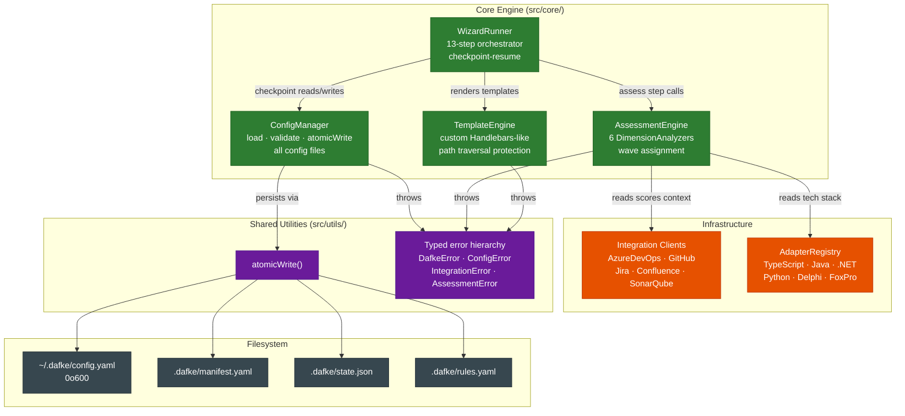
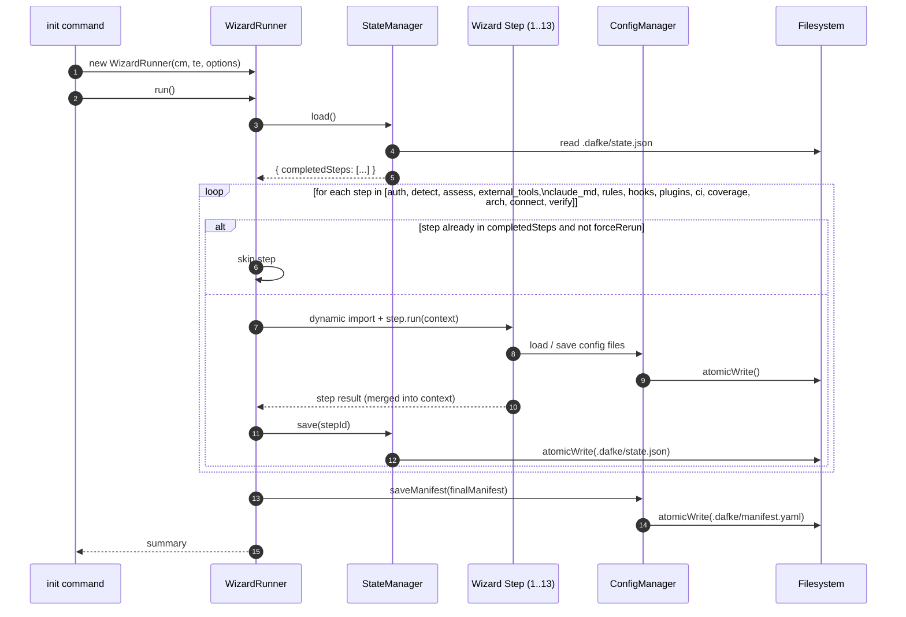
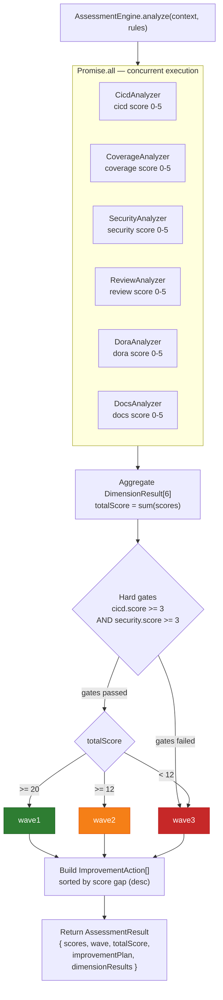
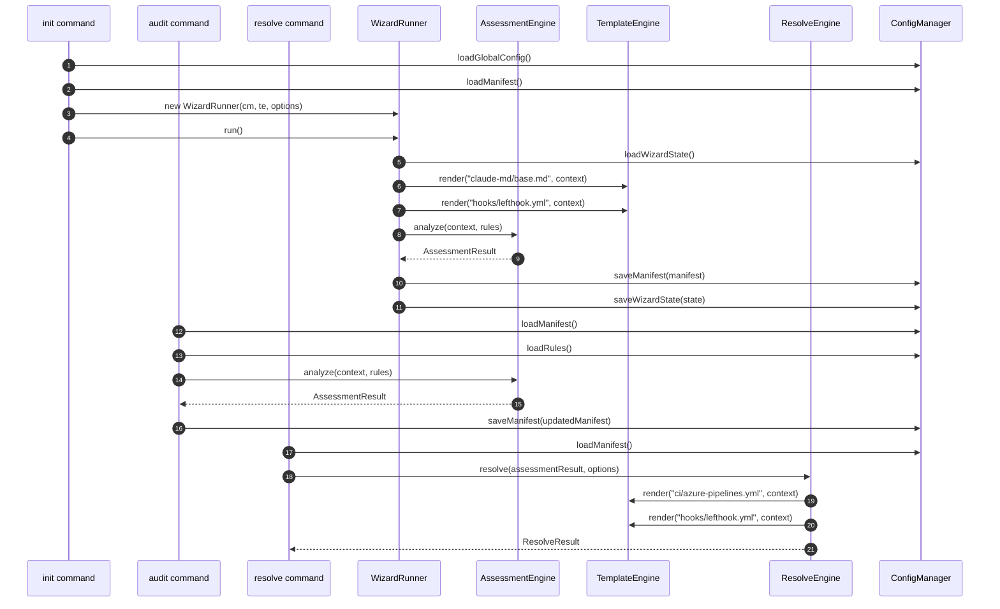

# Core Engine — dafke

> Deep dive into the four central domain classes: AssessmentEngine, WizardRunner, TemplateEngine, and ConfigManager.
> All details derived from `src/core/`.

---

## Overview

The core engine is the application and domain layer of dafke (`src/core/`). CLI commands in `src/cli/commands/` delegate to it. Integration clients in `src/integrations/` and technology adapters in `src/adapters/` serve it.

The four central classes each own a well-bounded concern:

| Class | Directory | Responsibility |
|-------|-----------|---------------|
| `ConfigManager` | `src/core/config/` | Load, validate, persist, and migrate all configuration files |
| `WizardRunner` | `src/core/wizard/` | Orchestrate the 13-step onboarding sequence with checkpoint-resume |
| `AssessmentEngine` | `src/core/analyzer/` | Score a repository across 6 dimensions and assign a wave |
| `TemplateEngine` | `src/core/scaffold/` | Render configuration file templates with path traversal protection |



---

## ConfigManager

**Source**: `src/core/config/config-manager.ts`

ConfigManager is the single point of access for all persistent state. It loads, validates, and writes four file types:

| File | Method | Schema |
|------|--------|--------|
| `~/.dafke/config.yaml` | `loadGlobalConfig()` / `saveGlobalConfig()` | `GlobalConfigSchema` |
| `.dafke/manifest.yaml` | `loadManifest()` / `saveManifest()` | `RepoManifestSchema` |
| `.dafke/state.json` | `loadWizardState()` / `saveWizardState()` | `WizardStateSchema` |
| `.dafke/rules.yaml` | `loadRules()` | `RulesSchema` |

### Schema Validation

All schemas are defined in `src/core/config/config-schema.ts` using Zod. Validation is applied on **both load and save** (defense in depth). `ConfigManager.saveGlobalConfig()` calls `.parse()` before writing, ensuring no corrupt data reaches the filesystem.

### Atomic Writes

Every file write calls `atomicWrite(filePath, content, mode?)` from `src/utils/fs.ts`. The sequence is:

1. Write content to a temp file in the same directory (same device, safe for atomic rename).
2. Set file permissions if `mode` is provided (used for `0o600` on `config.yaml`).
3. Atomically rename temp file to the target path.
4. On any error, clean up the temp file.

This prevents partial writes from corrupting configuration on crash or power loss.

### Schema Migration

`loadManifest()` transparently applies migrations before returning the manifest. Migrations are defined in `src/core/config/schema-migration.ts` and are versioned. The migration process:

1. Backs up the existing manifest before any changes (`backupManifest()`).
2. Applies the required migration steps.
3. On failure, restores the backup (`restoreManifest()`).
4. Writes an audit trail to `.dafke/migration-log.json` (`logMigration()`).

All callers (doctor, status, audit, update) benefit from transparent migration without code changes.

### Rules Customization

`src/core/config/rules-schema.ts` defines the `RulesSchema` for `.dafke/rules.yaml`. This file allows teams to override assessment hard-gate thresholds and wave score thresholds. If the file does not exist, default values from the schema are used.

### Public Interface (library export)

```typescript
// src/index.ts
export { ConfigManager } from './core/config/config-manager.js';
export type { GlobalConfig, RepoManifest, WizardState } from './core/config/config-schema.js';
```

---

## WizardRunner

**Source**: `src/core/wizard/` (runner + 13 step files)

WizardRunner orchestrates the 13-step onboarding sequence. It uses `StateManager` for checkpoint-resume, and loads each step module lazily (dynamic import) to keep startup time low.



### Step Lifecycle

```
WizardRunner.run(options)
  -> StateManager.load()           // resume from last checkpoint if --resume
  -> for each step in STEPS:
       -> if step.id in completedSteps and !forceRerun: skip
       -> lazy import(stepModule)
       -> step.run(context)        // interactive prompts via @clack/prompts
       -> StateManager.save(stepId) // checkpoint
  -> WizardRunner.summarize()
```

### Step Inventory

| Step ID | Module | Key Action |
|---------|--------|------------|
| `auth` | `step-auth.ts` | Collect and validate service credentials |
| `detect` | `step-detect.ts` | Run `AdapterRegistry.detect()` to identify tech stack |
| `assess` | `step-assess.ts` | Run `AssessmentEngine` and display scores |
| `external_tools` | `step-external-tools.ts` | Configure SonarQube and other external tools |
| `claude_md` | `step-claude-md.ts` | Generate CLAUDE.md via `TemplateEngine` |
| `rules` | `step-rules.ts` | Generate `.claude/rules/*.md` files |
| `hooks` | `step-hooks.ts` | Write `.claude/settings.json` and generate MCP wrapper scripts |
| `plugins` | `step-plugins.ts` | Install recommended Dafke plugins via `claude plugin install` |
| `ci` | `step-ci.ts` | Generate CI pipeline files (lefthook, azure-pipelines.yml) |
| `coverage` | `step-coverage.ts` | Analyse coverage config and generate Vitest/Jest threshold config |
| `arch` | `step-arch.ts` | Run `docs` pipeline to generate initial architecture docs |
| `connect` | `step-connect.ts` | Connect project board (Jira / Azure DevOps Boards) |
| `verify` | `step-verify.ts` | Final verification: re-run checks, display summary |

### StateManager

`StateManager` (`src/core/state/`) reads and writes `.dafke/state.json` via `ConfigManager`. The state tracks completed step IDs, partial results, and the options used to start the wizard. State is used exclusively by `--resume` to skip already-completed steps.

### Context Object

Each step receives a `WizardContext` containing:
- `ConfigManager` instance (for config reads/writes)
- `TemplateEngine` instance
- `options` (parsed CLI flags)
- Accumulated step results from previous steps (e.g., detected tech stack from `detect` is available to `assess`)

### --skip and --non-interactive

`--skip` causes the runner to mark the specified steps as already completed before iteration begins, effectively skipping them. `--non-interactive` sets a flag on the context that each step reads to suppress prompts and use defaults.

---

## AssessmentEngine

**Source**: `src/core/analyzer/`

AssessmentEngine runs 6 `DimensionAnalyzer` instances in parallel and produces a scored `AssessmentResult` with wave assignment and improvement plan.



### Execution Model

```typescript
// Conceptual — all 6 analyzers run in parallel via Promise.all
const results = await Promise.all([
  cicdAnalyzer.analyze(context),
  coverageAnalyzer.analyze(context),
  securityAnalyzer.analyze(context),
  reviewAnalyzer.analyze(context),
  doraAnalyzer.analyze(context),
  docsAnalyzer.analyze(context),
]);
```

Each analyzer returns a `DimensionResult`:

```typescript
interface DimensionResult {
  dimension: string;       // 'cicd' | 'coverage' | 'security' | 'review' | 'dora' | 'docs'
  score: number;           // 0-5
  details: string;         // human-readable summary
  evidence: string[];      // files and signals found
  suggestions: string[];   // actionable improvement steps
  scoringRationale: string; // explanation of score (shown with --explain)
}
```

### Wave Assignment Logic

```
hardGatesMet = cicd.score >= 3 AND security.score >= 3
totalScore = sum of all dimension scores

if hardGatesMet AND totalScore >= 20 -> wave1
if hardGatesMet AND totalScore >= 12 -> wave2
else                                 -> wave3
```

Both the gate thresholds (3) and wave thresholds (20, 12) are configurable in `.dafke/rules.yaml`.

### Improvement Plan

AssessmentEngine generates an `ImprovementAction[]` sorted by priority (highest-gap dimensions first). Each action includes:

```typescript
interface ImprovementAction {
  dimension: string;
  priority: 'critical' | 'high' | 'medium' | 'low';
  action: string;
  currentScore: number;
  targetScore: number;
  estimatedTime: string;
}
```

The improvement plan is surfaced by `audit --format json`, `status`, and the `verify` wizard step.

### Score Override

The `--override cicd=5,security=4` option on `audit` bypasses analyzer execution for specified dimensions and injects the given scores directly. This is useful for dimensions where automated detection cannot accurately measure the reality (e.g., DORA metrics that require external data).

### `--deep` Mode

When `--deep` is set, `AssessmentEngine` delegates to the Claude Code CLI (`claude`) for AI-powered analysis of each dimension. This produces richer evidence and more precise scores but requires the Claude Code CLI to be installed and authenticated.

### ResolveEngine

A related subsystem in `src/core/resolver/` consumes `AssessmentResult` and generates configuration files to raise dimension scores. Four resolvers are registered: `CicdResolver`, `SecurityResolver`, `CoverageResolver`, `ReviewResolver`. They are invoked by the `resolve` command and use `TemplateEngine` to render their output files.

---

## TemplateEngine

**Source**: `src/core/scaffold/template-engine.ts`

TemplateEngine is a custom Handlebars-like renderer. It resolves template files from a three-tier override system and renders them with a variable context.

### Template Resolution Order

1. `$DAFKE_TEMPLATES_DIR` environment variable (if set)
2. `.dafke/templates/` in the current working directory (repo-level overrides)
3. Built-in `templates/` directory (bundled with the package)

The first location that contains the named template file wins. This allows teams to customize templates without forking the tool.

### Syntax

| Expression | Meaning |
|------------|---------|
| `{{var}}` | Variable substitution |
| `{{#if condition}}...{{/if}}` | Conditional block |
| `{{#each array}}...{{/each}}` | Iteration block |
| `{{#if (eq var "value")}}...{{/if}}` | Equality comparison in conditional |

This is a subset of Handlebars syntax, implemented without the full Handlebars library.

### Path Traversal Protection

`getTemplate(name)` enforces path containment before reading any file:

```typescript
const resolved = path.resolve(this.templatesDir, name);
if (!resolved.startsWith(path.resolve(this.templatesDir))) {
  throw new Error(`Path traversal attempt: ${name}`);
}
```

This is applied to all three override locations. The `hasTemplate(name)` method (boolean existence check) does not include this guard, but since it reads no file content the practical impact is limited.

### Template Inventory

Built-in templates in `templates/`:

| Directory | Contents |
|-----------|----------|
| `templates/claude-md/` | CLAUDE.md base template and section partials |
| `templates/hooks/` | `lefthook.yml` git hooks template |
| `templates/rules/` | Per-tech-stack `.claude/rules/*.md` files |
| `templates/ci/` | Azure Pipelines YAML templates |
| `templates/gendoc/` | Architecture documentation templates including crew agent definitions |

### Usage in Commands

`TemplateEngine` is used by:
- `WizardRunner` (steps: `claude_md`, `rules`, `hooks`, `ci`)
- `ResolveEngine` (dimension resolvers)
- `docs` command (architecture documentation assembly, crew agent generation)

---

## Interactions Between the Four Classes



The typical `init` interaction:

```
init command
  -> new WizardRunner(configManager, templateEngine, options)
  -> WizardRunner.run()
     -> step-auth: configManager.saveGlobalConfig(credentials)
     -> step-detect: adapterRegistry.detect() -> manifest.techStack
     -> step-assess: assessmentEngine.analyze() -> manifest.scores, manifest.wave
     -> step-claude-md: templateEngine.render('claude-md/base.md', context) -> CLAUDE.md
     -> step-hooks: templateEngine.render('hooks/lefthook.yml', context) -> lefthook.yml
     -> ... (remaining steps)
  -> configManager.saveManifest(manifest)
```

The `audit` command path (standalone):

```
audit command
  -> configManager.loadManifest()     // may trigger schema migration
  -> configManager.loadRules()        // load threshold overrides
  -> assessmentEngine.analyze(context, rules)
  -> configManager.saveManifest(updatedManifest) // persist scores
  -> display results
```

---

## Error Handling

The core engine uses a typed error hierarchy defined in `src/utils/errors.ts`. All classes extend the `DafkeError` base class:

| Error Class | When Thrown |
|-------------|-------------|
| `DafkeError` | Base class — carries `code`, `message`, `recoverable`, and `suggestion` fields |
| `ConfigError` | Invalid config file, schema validation failure, missing required file |
| `StateError` | Wizard state read/write failure or invalid checkpoint |
| `IntegrationError` | HTTP client failure (wraps status code and response body) |
| `AdapterError` | Technology adapter detection failure |
| `AssessmentError` | Analyzer failure (wraps underlying cause) |
| `ResolveError` | Resolver failure when generating configuration files |

Each error class carries:
- `code` — machine-readable identifier
- `message` — human-readable description
- `recoverable` — boolean indicating whether the user can take corrective action
- `suggestion` — optional recovery hint

Commands catch these errors and display them via `@clack/prompts` UI before exiting with the appropriate code.

---

## Public Library API

`src/index.ts` exposes the core engine for programmatic use:

```typescript
// Classes
export { ConfigManager, StateManager, AdapterRegistry, createAdapterRegistry };
export { AssessmentEngine, WizardRunner };

// Utilities
export { printBanner, printCompactBanner, VERSION };

// Types
export type {
  GlobalConfig, RepoManifest, WizardState,
  TechStack, Wave, ReadinessScores,
  TechnologyAdapter, DetectionResult, AnalysisResult,
  AssessmentResult, ImprovementAction, DimensionResult
};
```

---

_Generated by Technical Writer Agent. Traceable to `src/core/`._
