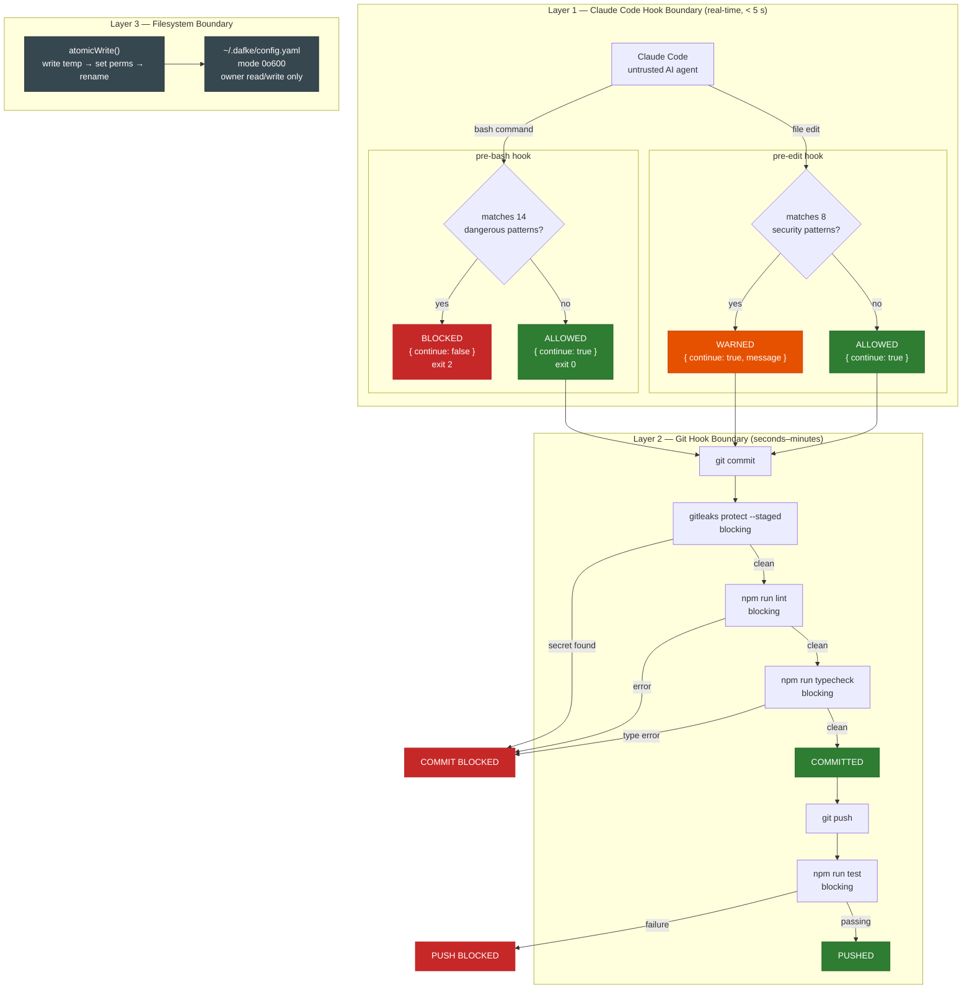
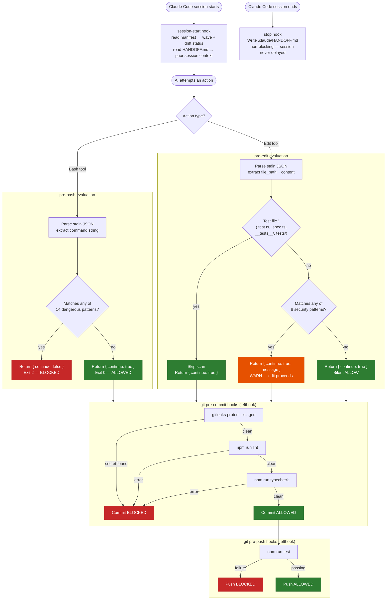

# Security Model — dafke

> All findings derived from source code inspection. Security analysis source: `.ccdocs/dafke/analysis/security-analysis.md`.

---

## Overview

dafke is a local developer tool with no HTTP server. It does not directly handle patient data or PHI. However, it manages credentials for five external services and installs guardrails for teams building healthcare software, making its security posture significant to the broader Dafke SDLC.

The security model operates at three layers:

| Layer | Mechanism | When it Runs |
|-------|-----------|--------------|
| Claude Code hooks | `pre-bash` (blocking), `pre-edit` (warn-only) | Every AI tool invocation |
| Git hooks via lefthook | gitleaks, lint, typecheck, tests | Every commit and push |
| CI pipeline | `azure-pipelines-pr.yml` | Every pull request |

A failure at any single layer is caught by subsequent layers (defense in depth).



---

## Authentication Model

### Credential Collection

Credentials are collected via two code paths:

- **Interactive wizard**: `src/core/wizard/steps/step-auth.ts` (step 1 of `dafke init`)
- **Direct command**: `src/cli/commands/connect.ts` (`dafke connect --service <name>`)

Both paths use `@clack/prompts` `p.password()` for secret input (masked terminal echo). Each credential set is tested against the remote service before being persisted. Connection failures prevent storage of invalid credentials.

### Credential Storage

All credentials are stored in `~/.dafke/config.yaml`:

| Service | Credential | Storage Key | File Mode |
|---------|-----------|-------------|-----------|
| Azure DevOps | Personal Access Token | `auth.azureDevOps.pat` | `0o600` |
| GitHub | Bearer token | `auth.github.token` | `0o600` |
| Jira | email + API token | `auth.jira.{ email, apiToken }` | `0o600` |
| Confluence | email + API token | `auth.confluence.{ email, apiToken }` | `0o600` |
| SonarQube | token | `auth.sonarqube.token` | `0o600` |

**Storage mechanism**: `ConfigManager.saveGlobalConfig()` calls `atomicWrite(filePath, content, 0o600)`, which writes to a temp file, sets permissions, then atomically renames to the target path.

**Known limitation (H-1)**: Credentials are stored as **plaintext YAML** with filesystem permission protection only. There is no encryption at rest. The `0o600` mode (owner read/write only) is the sole protection layer. Any process running as the same user can read the file.

### Credential Transmission

All integration clients extend `BaseClient` (`src/integrations/base-client.ts`). Credential-to-header mapping:

| Service | Scheme | Header Value |
|---------|--------|-------------|
| Azure DevOps | HTTP Basic | `Basic base64(:<PAT>)` |
| GitHub | Bearer | `Bearer <token>` |
| Jira | HTTP Basic | `Basic base64(<email>:<apiToken>)` |
| Confluence | HTTP Basic | `Basic base64(<email>:<apiToken>)` |
| SonarQube | HTTP Basic | `Basic base64(<token>:)` |

Base64 encoding is a transport encoding for HTTP Basic auth, not encryption.

### Azure DevOps MCP Wrapper

`src/core/wizard/steps/step-hooks.ts` generates `.claude/azure-devops-mcp.sh`, a shell script that:

1. Reads the PAT from `~/.dafke/config.yaml` via `grep` and `sed`
2. Base64-encodes it as `:PAT`
3. Exports it as `PERSONAL_ACCESS_TOKEN` environment variable for the MCP server subprocess

**Known limitation (M-2)**: The PAT is exposed in the process environment of the MCP server subprocess. On Linux this is visible in `/proc/<pid>/environ`. A future hardening approach is to write the PAT to a temporary file (mode `0o600`) and configure the MCP server to read from file instead.

---

## Authorization Logic

### Claude Code Hook Guardrails

The hook system (`src/cli/commands/hook.ts`) implements two authorization layers registered as `PreToolUse` hooks in `.claude/settings.json`.

#### Pre-Bash Command Blocking

`handlePreBash()` blocks 14 dangerous command patterns via regex matching. When a pattern matches, the hook returns `{ continue: false }` and exits with code 2, instructing Claude Code to abort the command.

| Pattern | Threat |
|---------|--------|
| `rm -rf /` | Filesystem destruction |
| `rm -rf *` | Wildcard deletion |
| `rm -rf ~` | Home directory destruction |
| `DROP TABLE` | Database table destruction |
| `DROP DATABASE` | Database destruction |
| `TRUNCATE TABLE` | Data truncation |
| `DELETE FROM ... ;` | Mass data deletion without WHERE clause |
| `mkfs.` | Disk format |
| `dd if=` | Raw disk write |
| Fork bomb `:(){ :|:& };` | Denial of service |
| `chmod -R 777 /` | Permission weakening |
| `git push --force origin main` | Irreversible history rewrite |
| `git push -f origin main` | Irreversible history rewrite |
| `git reset --hard HEAD~N` | Commit loss |

**Known limitation (H-3)**: These patterns use simple regex on the raw command string. Known bypass vectors:

- `rm -r -f /` (split flags) — not matched
- `git push --force-with-lease origin main` — not matched
- `git push origin main -f` (flag after branch) — not matched
- Shell variable obfuscation: `$RM -rf /` — not matched
- `git push --force origin master` (different branch) — not matched

Recommendation: normalize the command string (split on whitespace, sort flags, expand shell aliases) before pattern matching, or use a structured command parser.

#### Pre-Edit Security Scanning

`handlePreEdit()` scans file content for 8 security anti-patterns and returns `{ continue: true }` with warning messages (warn-only — the edit is never blocked). Test files (`.test.ts`, `.spec.ts`, `__tests__/`, `tests/`, `fixtures/`) are exempt.

| Pattern | Risk |
|---------|------|
| `eval(` | Arbitrary code injection |
| `innerHTML =` | Cross-site scripting |
| `document.write(` | Cross-site scripting |
| `child_process.exec(` | Command injection |
| `Function(` | Arbitrary code injection |
| `dangerouslySetInnerHTML` | Cross-site scripting (React) |
| `child_process` (import) | Command injection surface |
| `password\|secret\|api_key\|token = "..."` | Hardcoded credentials |

**Known limitation (H-2)**: Pre-edit patterns are warn-only. The AI agent receives the warning but proceeds with the edit. The hardcoded-credentials pattern carries the highest residual risk since committed secrets are an irreversible exposure. Recommendation: make the credentials pattern blocking (exit code 2) specifically; keep other patterns as warn-only to avoid false-positive blocks.

#### Static Permissions (`settings.json`)

The generated `.claude/settings.json` includes static allow and deny lists applied by Claude Code independent of the hook handler:

**Allow list**: `npm run *`, `npx *`, `git *`, `dafke *`, read-only commands (`cat`, `ls`, `find`, `grep`, `wc`, `head`, `tail`, `sort`, `diff`, `mkdir`), file operations (`Read`, `Edit`, `Write`, `Glob`, `Grep`), MCP tools.

**Deny list**: `rm -rf /`, `rm -rf ~`, `curl|bash`, `wget|bash`, `chmod 777 *`, `sudo *`, `ssh *`, `scp *`.

**Known limitation (L-2)**: `Bash(npm run *)` and `Bash(npx *)` allow arbitrary package script execution. The effective scope depends on what scripts are defined in `package.json`.

### Plugin Catalogue Validation

`src/cli/commands/plugin.ts` validates plugin names against `DAFKE_PLUGINS` from `src/core/plugins/catalogue.ts` before any installation attempt. Only 5 named plugins are accepted:

`dafke-sdlc`, `dafke-quality`, `dafke-observability`, `dafke-docs`, `dafke-config`

Unknown plugin names are rejected without calling the Claude Code CLI.

### Git Hook Guardrails

The generated `lefthook.yml` template configures the following hooks:

| Hook | Command | Blocks on Failure |
|------|---------|-------------------|
| pre-commit | `gitleaks protect --staged` | Yes |
| pre-commit | `npm run lint` | Yes |
| pre-commit | `npm run typecheck` | Yes |
| pre-push | `npm run test` | Yes |
| pre-push | `audit-ci --moderate` | No (`\|\| true`) |
| commit-msg | `commitlint --edit` | No (`\|\| true`) |
| commit-msg | Co-author check | Warning only |
| commit-msg | Ticket ID check | Warning only |

**Known limitation (M-5)**: `audit-ci --moderate` uses `|| true` (falls through on failure). Vulnerability scan results do not block the push. Recommendation: remove `|| true` for production branches.

---

## Data Protection

### File Write Integrity

All file writes use `atomicWrite()` (`src/utils/fs.ts`):

1. Write content to a temp file in the same directory.
2. Set file permissions if specified.
3. Atomically rename temp file to the target path.
4. Clean up temp file on any error.

This prevents partial writes from corrupting configuration on crash or interrupt.

### Path Traversal Protection

`TemplateEngine.getTemplate()` (`src/core/scaffold/template-engine.ts`) enforces path containment:

```typescript
const resolved = path.resolve(this.templatesDir, name);
if (!resolved.startsWith(path.resolve(this.templatesDir))) {
  throw new Error(`Path traversal attempt: ${name}`);
}
```

Applied to all three template override locations (env var, repo-level, built-in).

**Known limitation (M-3)**: `hasTemplate()` does not include this guard (boolean check only, no file content read). Low practical impact but inconsistent with defense-in-depth principle.

### Input Size Guards

| Boundary | Limit | Enforcement |
|----------|-------|-------------|
| Hook stdin | 1 MB | `MAX_STDIN_SIZE = 1_048_576` in `hook.ts` |
| HTTP response bodies | 10 MB | `MAX_RESPONSE_SIZE` in `base-client.ts` |
| HTTP request timeout | 30 seconds | `AbortController` in `base-client.ts` |
| HTTP rate-limit retry | 2 retries max | `Retry-After` capped at 60s in `base-client.ts` |

### Zod Schema Validation

All external data boundaries are validated with Zod schemas:

| Schema | File | Boundary |
|--------|------|----------|
| `GlobalConfigSchema` | `config-schema.ts` | `~/.dafke/config.yaml` (load and save) |
| `RepoManifestSchema` | `config-schema.ts` | `.dafke/manifest.yaml` (load and save) |
| `WizardStateSchema` | `config-schema.ts` | `.dafke/state.json` (load and save) |
| `RulesSchema` | `rules-schema.ts` | `.dafke/rules.yaml` (load only) |

Validation happens on both read and write. `ConfigManager` calls `.parse()` before every write, ensuring invalid data cannot reach the filesystem.

### Schema Migration Safety

`src/core/config/schema-migration.ts` migrations include:

- Backup before migration (`backupManifest()`)
- Rollback on failure (`restoreManifest()`)
- Audit trail written to `.dafke/migration-log.json` (`logMigration()`)

### Input Validation in CLI

- Service names validated against the enum `["azure-devops", "github", "jira", "confluence"]`
- Plugin names validated against the catalogue before installation
- URL inputs validated with `new URL()` constructor
- Email inputs use `includes("@")` (weak — see M-4 below)
- Hook stdin JSON parsed with `try/catch`; malformed JSON defaults to `{}` with a stderr warning

**Known limitation (M-4)**: Email validation in the `connect` command uses `includes("@")` while the schema uses `z.string().email()`. The `connect` command should delegate to the schema validator rather than reimplementing the check.

### API Path Construction

All integration clients use `encodeURIComponent()` for user-supplied path segments before interpolation into URL paths. The Azure DevOps MCP org name is validated with `/^[a-zA-Z0-9][a-zA-Z0-9-]*$/` before interpolation into shell commands.

---

## Guardrail System Architecture



The guardrail system runs at three different feedback loop speeds:

1. **Claude Code hooks** (< 5 seconds) — blocks or warns before the AI tool call executes.
2. **Git hooks via lefthook** (seconds to minutes) — blocks before code enters version control.
3. **CI pipeline** (minutes) — final gate before code merges to the main branch.

---

## OWASP Top 10 Status

| OWASP Category | Status | Notes |
|----------------|--------|-------|
| A01: Broken Access Control | Partially Mitigated | `0o600` file permissions protect credentials. No multi-user access control needed. |
| A02: Cryptographic Failures | **Finding** | Credentials stored as plaintext YAML (H-1). No encryption at rest. |
| A03: Injection | Mitigated | Pre-bash blocks dangerous commands. `encodeURIComponent()` on API paths. Template path traversal protection. |
| A04: Insecure Design | Mitigated | Defense-in-depth: Claude Code hooks + git hooks + CI pipeline + static permissions. |
| A05: Security Misconfiguration | Mitigated | Generated settings follow least-privilege. Deny list blocks sudo, ssh, scp. MCP server versions pinned. |
| A06: Vulnerable Components | Monitored | `audit-ci --moderate` in pre-push (warn-only). MCP server versions pinned in `MCP_VERSIONS` constant. |
| A07: Auth Failures | Partially Mitigated | Credentials tested before storage. No rotation enforcement. No session expiry. |
| A08: Data Integrity Failures | Mitigated | Atomic writes prevent corruption. Zod validation on load and save. Migration backup/rollback. |
| A09: Logging Failures | **Finding** | No audit log of credential access. Migration log exists but no general security event log (M-1). |
| A10: SSRF | Not Applicable | CLI tool. URLs are provided interactively by the user, not from untrusted external input at runtime. |

---

## Vulnerability Summary

### High Priority

| ID | Finding | Location | Recommendation |
|----|---------|----------|----------------|
| H-1 | Credentials stored as plaintext YAML | `~/.dafke/config.yaml` | Integrate with OS keychain (`keytar` or equivalent). Fall back to `0o600` file on unsupported systems. |
| H-2 | Pre-edit hardcoded-secrets pattern is warn-only | `src/cli/commands/hook.ts` `handlePreEdit()` | Block (exit code 2) specifically for the credentials pattern. Keep other patterns as warn-only. |
| H-3 | Pre-bash regex evasion via split flags and argument reordering | `src/cli/commands/hook.ts` `handlePreBash()` | Normalize the command string before regex matching. Add patterns for `rm -r -f` and reversed argument order. |

### Medium Priority

| ID | Finding | Location | Recommendation |
|----|---------|----------|----------------|
| M-1 | No credential access audit logging | `ConfigManager.loadGlobalConfig()` | Log credential access (timestamp, service, calling command) to `~/.dafke/audit.log` with rotation. |
| M-2 | PAT exposed in MCP wrapper environment | `step-hooks.ts` generated `.claude/azure-devops-mcp.sh` | Write PAT to a temporary `0o600` file; configure MCP server to read from file instead of environment. |
| M-3 | `hasTemplate()` lacks path traversal guard | `src/core/scaffold/template-engine.ts` | Add `resolve()` + `startsWith()` guard to match `getTemplate()`. |
| M-4 | Email validation inconsistency | `src/cli/commands/connect.ts` | Replace manual `includes("@")` with the Zod `.email()` validator already present in the schema. |
| M-5 | `audit-ci` pre-push hook falls through on failure | `templates/hooks/lefthook.yml` | Remove `\|\| true` from `audit-ci --moderate` for production branches. |

### Low Priority

| ID | Finding | Location | Recommendation |
|----|---------|----------|----------------|
| L-1 | No credential expiry warning | `ConfigManager` | Track creation date in config; warn during `doctor` or `session-start` when credentials are older than a threshold (default 90 days). |
| L-2 | Allow list permits arbitrary npm scripts | `.claude/settings.json` | Narrow `Bash(npm run *)` and `Bash(npx *)` to known script names from `package.json`. |
| L-3 | Commitlint falls through on failure | `templates/hooks/lefthook.yml` | Make blocking if conventional commits are a team requirement. |
| L-4 | No integrity check on generated hook files | `dafke doctor` | Add checksum verification for `settings.json` and `lefthook.yml` in `doctor`. |

---

## Compliance Considerations

### GDPR

- Developer email addresses (stored for Jira/Confluence) are personal data under GDPR.
- **Right to erasure**: No `dafke disconnect` command exists. Users must manually edit `~/.dafke/config.yaml` to remove credentials.
- **Data minimization**: Only credentials for configured services are stored. Unconfigured services have no stored data.

### HIPAA

- dafke does not directly handle PHI.
- The pre-bash, pre-edit, and gitleaks guardrails constitute **administrative safeguards** that help prevent credential leakage and enforce code quality on healthcare software repositories.
- The `security` dimension hard gate (must score >= 3 for wave1/wave2) enforces minimum security maturity before teams are cleared for AI-assisted development on healthcare codebases.
- The plaintext credential storage (H-1) is a gap if the developer workstation is considered part of the HIPAA security perimeter.

---

## Key Source Files

| File | Security Role |
|------|--------------|
| `src/cli/commands/hook.ts` | Hook handler: dangerous pattern and security anti-pattern definitions |
| `src/core/config/config-manager.ts` | Credential persistence with atomic write and `0o600` permissions |
| `src/core/config/config-schema.ts` | Zod schemas for all configuration including auth credentials |
| `src/integrations/base-client.ts` | HTTP client: auth headers, timeout, rate limiting, 10 MB response guard |
| `src/cli/commands/connect.ts` | Interactive credential collection |
| `src/core/wizard/steps/step-hooks.ts` | Hook and MCP configuration generation; ADO MCP wrapper script |
| `src/core/scaffold/template-engine.ts` | Template rendering with path traversal protection |
| `src/utils/fs.ts` | `atomicWrite()` implementation |
| `.claude/settings.json` | Active Claude Code hook registrations and permission rules |
| `templates/hooks/lefthook.yml` | Git hook template: gitleaks, lint, typecheck, tests |

---

_Generated by Technical Writer Agent. Traceable to `src/` source code._
